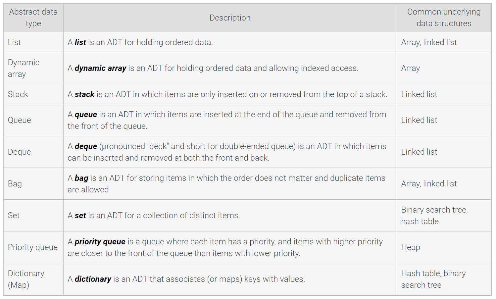

# Introduction to Data Structures and Algorithms

## Data Structures

Data Structure - Way of organizing, storing, and performing operations on data.

Record - Data structure that stores subitems

Array - Data structures that stores an ordered list of items

Linked List - stores an ordered list of items in nodes where each node stores data and has a pointer to the next node

Binary Tree - DS which each node stores data and has up to two dchildren, know as a left child and a right child

Hash Table - DS that stores unordered items by mapping or hashing each item to a location in an array

Heap - A max heap is a tree that maintains the simple property that a nodes key is greater than or equal to the nodes childrens keys. A min heap is a tree that maintains the simple property that a nodes key is less than or equal to the nodes children keys

Graph - A DS for representing connections among item, and consists of vertices connected by edges. A **vertex** represents an item in a graph. An edge represents a connection between two vertices in a graph.

## Intoduction to Algorithms

Algorithm definition... again... -describes a sequence of steps to solve a computational problem or perform a calculation.

Computational problem - specifies and input, a question about the input that can be answered using a computer and the desired output.

NP-complete problems are a set of problems for which no known efficient algorithm exits.

NP-complete problem characteristics
    1. No efficient algorithm has been found to solve an NP-complete problem.
    2. No one has proven that an efficient algorithm to solve an NP-complete problem is impossible.
    3. If an efficient algorithm exists for one NP-complete problem, then all NP-complete problems can be solved efficiently.

## Relation between data structures and algorithms

Operations like inserting, removing, and searching are typically speicifc to each data structure.

## Abstract Data Types

Abstract Data Types (ADT) - data type described by predefined user operations, such as "insert data at reat" without indicating how each operation is implemented.

## Aplications of ADTs

Abstraction - have a user interact with an item at a high-level, with lower level internal details hidden from the user.

## Algorithm Efficiency

Algorithm Efficiency is meausred by the algorithms compuatuinal complexity

Compuatational Complexity is the amount of resources used by the algorithm.

Runtime complexity is a function T(N) that represents the number of constat time operations that are performed by the algo on an imput size of N.

Best Case - Least possible number of operations

Worst Case - Most possible number of operations

Space Complexity - is a function S(N) that represents the number of fixed-size memory units used by the algo for an input size of N

Auxiliary Space Complexity - the space complexity not including the data.