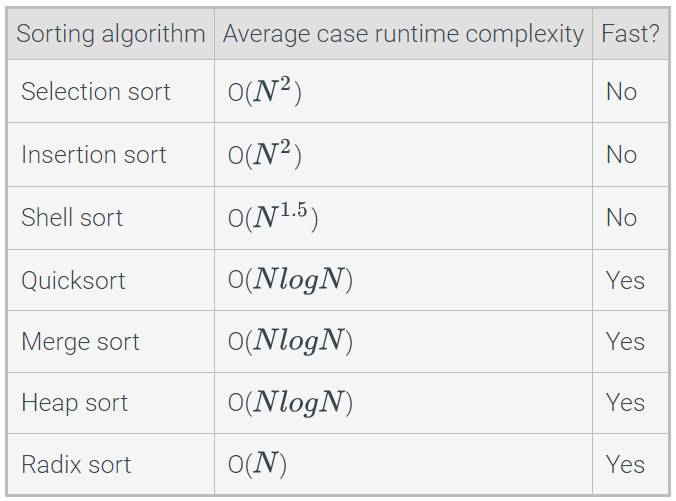

# Sorting Algorithms

## Selection Sort

Repeat of chapter 9....

## Python: Selection Sort

No return value because it is sorted in place.

def selection_sort(numbers):
   for i in range(len(numbers)-1):
      
      # Find index of smallest remaining element
      index_smallest = i
      for j in range(i+1, len(numbers)):
         
         if numbers[j] < numbers[index_smallest]:
            index_smallest = j
      
      # Swap numbers[i] and numbers[index_smallest]
      temp = numbers[i]
      numbers[i] = numbers[index_smallest]
      numbers[index_smallest] = temp

## Python: Insertion Sort

def insertion_sort(numbers):
    for i in range(1, len(numbers)):
        j = i

        # Insert numbers[i] into sorted part 
        # stopping once numbers[i] in correct position
        while j > 0 and numbers[j] < numbers[j - 1]:
            # Swap numbers[j] and numbers[j - 1]
            temp = numbers[j]
            numbers[j] = numbers[j - 1]
            numbers[j - 1] = temp
            j -= 1
    
Create a list of unsorted values    
numbers = [10, 2, 78, 4, 45, 32, 7, 11]

Print unsorted list
print('UNSORTED:', numbers)

Call the insertion_sort function
insertion_sort(numbers)

Print sorted list
print('SORTED:', numbers)

## Shell Sort

Shell Sort - Algorithm that treats the input as a collection of interleaved lists, and sorts each list individually with a varient of the insertion sort algorithm.

Shell sort uses gap values to determine the number of interleaved lists.

Gap Value - positive ineger representing the distance between elements in an interleaved list.

## Python: Shell Sort

def insertion_sort_interleaved(numbers, start_index, gap):
    for i in range(start_index + gap, len(numbers), gap):
        j = i
        while (j - gap >= start_index) and (numbers[j] < numbers[j - gap]):
            temp = numbers[j]
            numbers[j] = numbers[j - gap]
            numbers[j - gap] = temp
            j = j - gap

## Quicksort

Repeat of 9.8....

## Python: Quicksort

partition() splits the unsorted list into a left part and a right part based on a chosen element within the list called a pivot

partition() parameters
1. Unsorted List
2. Start Index
3. End Indez

def partition(numbers, start_index, end_index):
    # Select the middle value as the pivot.
    midpoint = start_index + (end_index - start_index) // 2
    pivot = numbers[midpoint]
   
    # "low" and "high" start at the ends of the list segment
    # and move towards each other.
    low = start_index
    high = end_index
   
    done = False
    while not done:
        # Increment low while numbers[low] < pivot
        while numbers[low] < pivot:
            low = low + 1
      
        # Decrement high while pivot < numbers[high]
        while pivot < numbers[high]:
            high = high - 1
      
        # If low and high have crossed each other, the loop
        # is done. If not, the elements are swapped, low is
        # incremented and high is decremented.
        if low >= high:
            done = True
        else:
            temp = numbers[low]
            numbers[low] = numbers[high]
            numbers[high] = temp
            low = low + 1
            high = high - 1
   
    # "high" is the last index in the left segment.
    return high

quicksort() uses recursion to sort the two parts of the list 

quicksort() parameters
1. unsorted list
2. start index
3. end index

def quicksort(numbers, start_index, end_index):
    # Only attempt to sort the list segment if there are
    # at least 2 elements
    if end_index <= start_index:
        return
          
    # Partition the list segment
    high = partition(numbers, start_index, end_index)

    # Recursively sort the left segment
    quicksort(numbers, start_index, high)

    # Recursively sort the right segment
    quicksort(numbers, high + 1, end_index)

## Python: Merge sort

Merge sort divides a list into two halves, recursively sorts each half, and then merges the sorted halves to produce a sorted list

Merge Sort Parameters
1. The list
2. start index
3. end index

def merge(numbers, i, j, k):
    merged_size = k - i + 1               # Size of merged partition
    merged_numbers = [0] * merged_size    # Dynamically allocates temporary array
                                          # for merged numbers
    merge_pos = 0                         # Position to insert merged number
    left_pos = i                          # Initialize left partition position
    right_pos = j + 1                     # Initialize right partition position
   
    # Add smallest element from left or right partition to merged numbers
    while left_pos <= j and right_pos <= k:
        if numbers[left_pos] <= numbers[right_pos]:
            merged_numbers[merge_pos] = numbers[left_pos]
            left_pos += 1
        else:
            merged_numbers[merge_pos] = numbers[right_pos]
            right_pos += 1
        merge_pos = merge_pos + 1
   
    # If left partition is not empty, add remaining elements to merged numbers
    while left_pos <= j:
        merged_numbers[merge_pos] = numbers[left_pos]
        left_pos += 1
        merge_pos += 1
   
    # If right partition is not empty, add remaining elements to merged numbers
    while right_pos <= k:
        merged_numbers[merge_pos] = numbers[right_pos]
        right_pos = right_pos + 1
        merge_pos = merge_pos + 1
   
    # Copy merge number back to numbers
    for merge_pos in range(merged_size):
        numbers[i + merge_pos] = merged_numbers[merge_pos]

def merge_sort(numbers, i, k):
    j = 0

    if i < k:
        j = (i + k) // 2  # Find the midpoint in the partition

        # Recursively sort left and right partitions
        merge_sort(numbers, i, j)
        merge_sort(numbers, j + 1, k)
            
        # Merge left and right partition in sorted order
        merge(numbers, i, j, k)

 Create a list of unsorted values
numbers = [61, 76, 19, 4, 94, 32, 27, 83, 58]

 Print unsorted list
print('UNSORTED:', numbers)

 Initial call to merge_sort
merge_sort(numbers, 0, len(numbers) - 1)

 Print sorted list
print('SORTED:', numbers)

## Radix Sort.

Radix sort is an algorithm designed specifically for integers

Radix uses a concept called buckets and is a type of bucket sort

A bucket is a collection of ineger values that all share a particular digit

## Python: Radix Sort

# Returns the maximum length, in number of digits, out of all list elements 
def radix_get_max_length(numbers):
    max_digits = 0
    for num in numbers:
        digit_count = radix_get_length(num)
        if digit_count > max_digits:
            max_digits = digit_count
    return max_digits

# Returns the length, in number of digits, of value
def radix_get_length(value):
    if value == 0:
        return 1
   
    digits = 0
    while value != 0:
        digits += 1
        value = int(value / 10)
    return digits

def radix_sort(numbers):
    buckets = []
    for i in range(10):
        buckets.append([])
    
    # Find the max length, in number of digits
    max_digits = radix_get_max_length(numbers)
    
    pow_10 = 1
    for digit_index in range(max_digits):
        for num in numbers:
            bucket_index = (abs(num) // pow_10) % 10
            buckets[bucket_index].append(num)

        numbers.clear()
        for bucket in buckets:
            numbers.extend(bucket)
            bucket.clear()
      
        pow_10 = pow_10 * 10
    
    negatives = []
    non_negatives = []
    for num in numbers:
        if num < 0:
            negatives.append(num)
        else:
            non_negatives.append(num)
    negatives.reverse()
    numbers.clear()
    numbers.extend(negatives + non_negatives)

 Create a list of unsorted values
numbers = [47, 81, 13, 5, 38, 96, 51, 64]

 Print unsorted list
print('UNSORTED:', numbers)

 Call radix_sort to sort the list
radix_sort(numbers)

 Print sorted list
print('SORTED:', numbers)

## Overview of Fast Sorting Algorithms

Fast sorting algorithms are algos that have an average runtime complexity of O(nLogn) or better

Element Comparison Sorting Algorithm - operates on an array of elements that can be compared to eachother

## Python: Sorting with Different Operators

sort() - sorts in place

sorted() - returns a new list with sorted elements

sort and sorted can both take keyword argument reverse to sort in descending order

key functions can also be used which determines how to sort a list
key - str.lower

Custom key functions can also be used to sort a list by one of the elements' values if each element forms a tuple

itemgetter() can be used to get a key from an element using an index instead of a custom key function