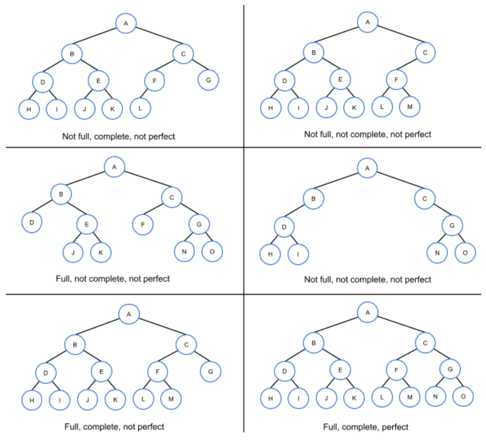
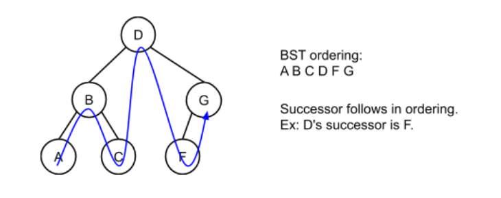

# Trees

## Binary Trees

Binary Tree - Each node has up to two children, known as left and right child.

Leaf - A tree node with no children

Internal Node - A node with at least one child

Parent - A node with a child is that childs parent

Ancestors - Include a nodes parent, parents parent, all the way up to the root

Root - The one tree node with no parent. The top node

Edge - the link between a node to a child

Depth - Number of edges on the path from the root to the node

Level - All nodes with the same depth

Height - The largest depth of any node

Full Tree - Every node contains either 0 or two children

Complete Tree - All levels except possibly hte last level contain all nodes and all nodes in the last level are as far left as possible

Perfect Tree - All internal nodes have 2 children and all leaf nodes are at the same level

## Applications of Trees

Trees are commonly used to represent hiertatchical data, like that of file systems.

Binary Space Partitioning (BSP) - Technique of repeatedly seperating a region of space into 2 parts and cotaloging object contained within regions. 

BSP Tree - Binary Tree used to store information for binary space partitioning.

## Binary Search Trees

Binary Search Tree - a form of binary tree that has an ordering property that any nodes left subree keys are less than or equal to the nodes key and the right subrees keys are greaterthan or equal to the nodes key.

Searching a BST may yield faster searches than a list.

BST defines ordering among nodes, from smallest to largest.

Successor - Node that comes after in the BST ordering

Predecessor - Node that comes before in BST Ordering

## BST Search Algorithm

Search - Returns the first node found matching the key or returns null if a matching node is not found. 

## BST Insert Algorithm

Insert - Inserts a new node in a proper location obeying proper BST ordering.

## BST Remove Algorithm

Remove - removes the first-found matching node, restructuring the tree to preserve the BST order.

If removal node is found the algo performs one of the following sub-algorithms.
1. Remove a leaf node
2. Remove an internal node with a single child
3. Remove an internal node with two children

BSTRemove(tree, key) {
   par = null
   cur = tree⇢root
   while (cur is not null) { // Search for node
      if (cur⇢key == key) { // Node found 
         if (cur⇢left is null && cur⇢right is null) { // Remove leaf
            if (par is null) // Node is root
               tree⇢root = null
            else if (par⇢left == cur) 
               par⇢left = null
            else
               par⇢right = null
         }
         else if (cur⇢right is null) {                // Remove node with only left child
            if (par is null) // Node is root
               tree⇢root = cur⇢left
            else if (par⇢left == cur) 
               par⇢left = cur⇢left
            else
               par⇢right = cur⇢left
         }
         else if (cur⇢left is null) {                // Remove node with only right child
            if (par is null) // Node is root
               tree⇢root = cur⇢right
            else if (par⇢left == cur) 
               par⇢left = cur⇢right
            else
               par⇢right = cur⇢right
         }
         else {                                      // Remove node with two children
            // Find successor (leftmost child of right subtree)
            suc = cur⇢right
            while (suc⇢left is not null)
               suc = suc⇢left
            successorData = Create copy of suc's data
            BSTRemove(tree, suc⇢key)     // Remove successor
            Assign cur's data with successorData
         }
         return // Node found and removed
      }
      else if (cur⇢key < key) { // Search right
         par = cur
         cur = cur⇢right
      }
      else {                     // Search left
         par = cur
         cur = cur⇢left
      }
   }
   return // Node not found
}

## BST Inorder Traversal

Tree Traversal - an algo that vistis all nodes in the tree once and performs an operation on each node.

Inorder Traversal - visits all nodes in a BST from smallest to largest

## BST Height and Insertion Order

Height - Maximum edges from root to any leaf.

Given a node representing a BST subtree the height can be computed as follows
1. If the node is null, return -1
2. Otherwise recursively compute the left and right child subtree heights, and return 1 plus the greater of the 2 child subtrees' heights.

## BST Parent Node Pointers

BST implementation often includes a parent pointer inside each node.

## BST: Recursion

BST Search can be implemented using recursion. A single node and search key are passed as arguments to the recursive search funtion.

Base Cases
1. Node is Null
2. Search key == nodes key

BSTSearch(tree, key) {
   return BSTSearchRecursive(tree⇢root, key)
}

BSTSearchRecursive(node, key) {
   if (node is not null) {
      if (key == node⇢key)
         return node
      else if (key < node⇢key)
         return BSTSearchRecursive(node⇢left, key)
      else
         return BSTSearchRecursive(node⇢right, key)
   }
   return null
}

BST get parent algo - searches for a parent in a way similar to the normal BST Search but instead of comparing the search key is compared with the keys of the candidates nodes children.

BSTGetParent(tree, node) {
   return BSTGetParentRecursive(tree⇢root, node)
}

BSTGetParentRecursive(subtreeRoot, node) {
   if (subtreeRoot is null)
      return null

   if (subtreeRoot⇢left == node or 
       subtreeRoot⇢right == node) {
      return subtreeRoot
   }

   if (node⇢key < subtreeRoot⇢key) {
      return BSTGetParentRecursive(subtreeRoot⇢left, node)
   }
   return BSTGetParentRecursive(subtreeRoot⇢right, node)
}

Recursive BST Insertion and Removal

Insertion - uses recursion to traverse down the tree until the insertion location is found

Removal - uses recursive search to find the node and the nodes parent, then removes the node from the tree

BSTInsert(tree, node) {
   if (tree⇢root is null)
      tree⇢root = node
   else
      BSTInsertRecursive(tree⇢root, node)
}

BSTInsertRecursive(parent, nodeToInsert) {
   if (nodeToInsert⇢key < parent⇢key) {
      if (parent⇢left is null)
         parent⇢left = nodeToInsert
      else
         BSTInsertRecursive(parent⇢left, nodeToInsert)
   }
   else {
      if (parent⇢right is null)
         parent⇢right = nodeToInsert
      else
         BSTInsertRecursive(parent⇢right, nodeToInsert)
   }
}

BSTRemove(tree, key) {
   node = BSTSearch(tree, key)
   parent = BSTGetParent(tree, node)
   BSTRemoveNode(tree, parent, node)
}

BSTRemoveNode(tree, parent, node) {
   if (node == null)
      return false
        
   // Case 1: Internal node with 2 children
   if (node⇢left != null && node⇢right != null) {
      // Find successor and successor's parent
      succNode = node⇢right
      successorParent = node
      while (succNode⇢left != null) {
         successorParent = succNode
         succNode = succNode⇢left
      }
            
      // Copy the value from the successor node
      node = Copy succNode
            
      // Recursively remove successor
      BSTRemoveNode(tree, successorParent, succNode)
   }

   // Case 2: Root node (with 1 or 0 children)
   else if (node == tree⇢root) {
      if (node⇢left != null)
         tree⇢root = node⇢left
      else
         tree⇢root = node⇢right
   }

   // Case 3: Internal with left child only
   else if (node⇢left != null) {
      // Replace node with node's left child
      if (parent⇢left == node)
         parent⇢left = node⇢left
      else
         parent⇢right = node⇢left
   }

   // Case 4: Internal with right child only OR leaf
   else {
      // Replace node with node's right child
      if (parent⇢left == node)
         parent⇢left = node⇢right
      else
         parent⇢right = node⇢right
   }        

   return true
}

## Tries

Trie (or prefix tree) - a tree representing a set of strings, each non root represents a single character, each node has at most one child

Terminal node - a node that represents a terminating character which is the end of the string trie

Trie Insert - Creates a path from the root to a terminal node that visits all the strings characters in sequence

CurNode points to the root then a loop iterates through the string characters. 
1. A new child is added only if the current node does not have a child
2. The curNode pointer is assigned with the current nodes child

Trie Search - Returns the terminal node corresponding to that string

Trie Remove - removes the string correspnding terminal node and all non root ancestors with 0 children

## Python: Binary Search Tree

[Python Code for A BST](../Trees.py)