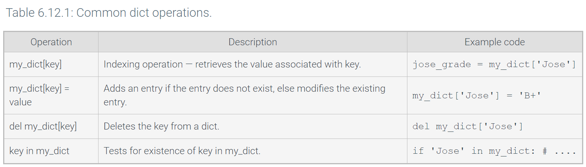
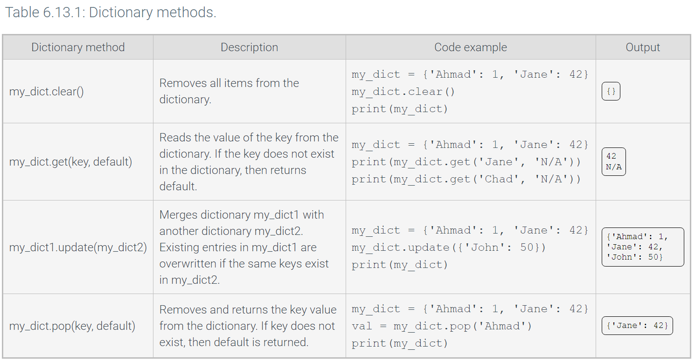

# Lists and Dictionaries

## Lists

A list is a container which is an object that groups **related** objects together.

The contained objects maintain a left to right positional order

Objects can be accessed via index

Each object can be different types such as string integers floats and even other lists

Lists are mutable and they grow and shrink without replacing the entire list. This is called **in-place modification**

## List Methods

List methods can perform useful operations on a list

list.append(x) add an item to the end of a list

list.extend(x) add all item in [x] to list

list.insert(i,x) insert x into the lost **before** position i.

list.remove(x) remove first item from list with value x

list.pop() remove and return last item in list

list.pop(i) remove and return item at position i in list

list.sort() sort the items of list in place

list.reverse() reverse the elements of list in place

list.index(x) returns the index of first item in list with value x

list.count(x) count the number of times value x is in list

## Iterating Over a List

For loop  - Looping through a sequence such as a list

for my_var in my_list:
    # Loop body statements go here

IndexError - trying to access an index that does not exist 

enumerate() - iteration counter

all(list) True if every element in list is true

any(list) True if any element in list is true

max(list) Get the max element in the list

min(list) get the min element in the list

sum(list) get the sum of all elements in list.

## List Games

## List Nesting

List Nesting - embedding a list within a list

Listing allows programmers to create multi-dimensional data structures. 

Can access all elements of nested lists by using nested for loops
for row in currency:
    for cell in row:

## List Slicing

Slice notation allows programmers to read multiple elements from a list, creating a new list that only contains desired elements.
my_list[0:2] 0 is the first element to read and 2 is the last element and is not included.

Stride is also used in list slicing just like string slicing.

my_list[start:end] get a list from start to end (minus 1)

my_list[start:end:stride] get a list of every stride element from start to end (minus 1)

my_list[start:] get a list from start to end of the lost

my_list[:end] get a list from beginning of the list to the end (minus 1)

my_list[:] get a copu of the list

## Loops Modifying Lists

Iterating over a list while modifying elements

## List Comprehensions

List Comprehension - Modifying every element of a list in the same way

List Comprehensions has three componets
    1. An expression to evaluate each element in the iterable element.
    2. A loop variable to bind to the current iteration element.
    3. An iterable object

## Sorting Lists

sort() perfrorms an in-place rearranging of list elements, sorting from lowest to highest.

sorted() same as sort() but returns a new list and the old list remains unmodified.

Key - SPecifies a function to be applied to each element before being compared

## Command-line Arguments

Command-Line Arguments - values entered by a user when running a program from command line

## Dictionaries

Dictionaries contain references to object as key-value pairs where each key is associated with a value

dict implements a dictionary in pyton

Appraches to Create a dict
    1. wraps braces {} around key-value pairs and/or variables
        {'Jose': 'A+', 'Gino': 'C-'}
    2. Dictionary Comprehension - evaluates a loop to creat a new dict.
    3. dict() built in function
        dict(Bobby='805-555-2232', Johnny='951-555-0055')

Dictionaries are mutable

## Dictionary Methods

Dictionary Method - A function provided by the dictionary type that operates on a specific dictionary object

## Iterating Over a Dictionary

Hash - A transformation of the key into a unique value that allows the interpereter to perform a fast lookup.

dict.item() - returns a view object that yields (key, value) tuples
dict.keys() - returnds dict keys
dict.values() - returns dict values

## Dictionary Nesting

Nested Dictionaries - Dictionary contains another dictionary as a value.

students = {}
students ['Jose'] = {'Grade': 'A+', 'StudentID': 22321}

print('Jose:')

print(f' Grade: {students ["Jose"]["Grade"]}')

print(f' ID: {students["Jose"]["StudentID"]}')

Data Structure - Method of organizing data in a logical and coherent fashion.

