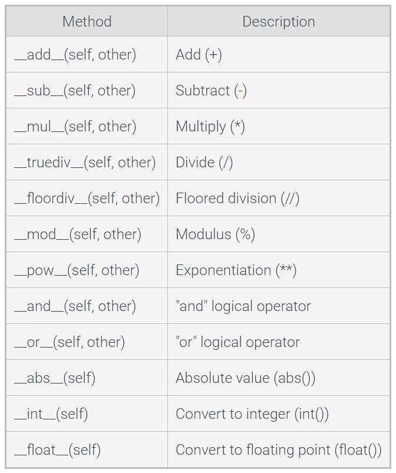

# Classes

## Classes: Introduction

Object - Group of data (variables) and operations that can be performed on that data (functions or methods)

Abstractions - when a user interacts with an object at a high level, hiding lower-level internal details. 

Abstraction is also known as information hiding or encapsulation

Abstract Data Type - a data type whose creation and update are constrained to specific well-defined operations.

## Classes: Grouping Data

Class
    Variable
    Variable

Weather
    temperature
    percipitation
    wind

class Time:
    """ A class that represents a time of day """
    def __init__(self):
        self.hours = 0
        self.minutes = 0

Objects maintain a set of attributes that determines that data and behavior of a class

This can be used to instantiate a class by using parentheses such as
my_time = Time()

This creates and instance which is an individual object of the given class.

Instantiation operation automatically calls the __init__ method.

__init__ is commonly known as the constructor and is responsible for setting up the initial state of a new instance

__init__ has a single parameter "self" that automatically references the instance being created.

Multiple instances of a class can be created using different atribute values

time1 = time()
time1.hours = 7
time1.minutes = 30

time2 = time()
time2.hours = 12
time2.minutes = 45

## Instance Methods

Instance Method - A function defined within a class.

    def print_time(self):
        print(f'Hours: {self.hours}', end=' ')
        print(f'Minutes: {self.minutes}')

__init__ is a special method name indicating that the method implements some special behavior of the class

## Class and Instance Object Types

Class object - A 'factory' that creates instance onjects.

Class attribute - shared among all instance of that class

Instance Atrribute - can be unique to each instance

## Class Constructors

The __init__ method constructor can be customized with additional parameters.

class RaceTime:
    def __init__(self, start_time, end_time, distance):
        """
         start_time: Race start time. String w/ format 'hours:minutes'.
         end_time: Race end time. String w/ format 'hours:minutes'.
         distance: Distance of race in miles.
        """
    # ...

The race times of marathon contestants

time_jason = RaceTime('3:15', '7:45', 26.21875)
time_bobby = RaceTime('3:15', '6:30', 26.21875)

Constructor parameters can have default values.

def __init__(self, name, wage=8.25, hours=20):

## Class Interfaces

Class Interface - Consists of the methods that a programmer calls to create, modify, or access a class instance

Classes can contain methods used internally that a user of the class need not access. 

## Class Customization

Class customization - process of defining how a class should behave for common operations.

To customize a class the programmer inplements instance methods with special method names

Class customization can redefine the functionality of built in operators when used with class instances.

Rich Comparison Methods
__lt__(self, other) - less than 
__le__(self, other) - les than or equal to
__gt__(self, other) - greater than
__ge__(self, other) - greather than or equal to
__eq__(self, other) - equal to
__ne__(self, other) - not equal to

## More Operator Overloading: Classes as Numeric Types

Numeric operatiors such as +, -, *, and / can be overloaded using class customization techniques.

inistance() - returns True or False Boolean depending on whether a given variable mathces a given type.

## Memory Allocation and Garbage Collection

Memory Allocation - Process of an application requesting and being granted memory

Memory Deallocation - act of freeing the memory that stores variables or objects in a program.

In python objects are automatically deallocated.

Reference Count - Integer counter that represents how many variables reference an object.

Once reference count is 0 the garbage collector deallocates the memory